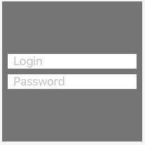
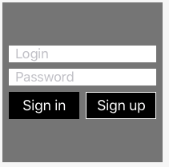

Arrange is a small library that simplifies layout creation of your views. As example:

<table width="100%"><tr>
<td><pre lang="swift">
arrange(
    [.centeredVertically, .left(8), .right(8), .spacing(8)],
    loginTextField,
    passwordTextField
)
</pre></td>
<td width="200px"></td>
</tr></table>


`arrange` method does two things at the same time: adds provided views as subviews, and layouts them. By default subviews will be stacked vertically, and aligned to superviews edges. Default behaviour can be overriden using the first argument, an array of enum cases. For example passing `.spacing(8)` changes spacing on `UIStackView` (created internally) to the provided value. 


##### Chaining

`arrange` methods can be chained together to form complicated view hierarchy:

<table width="100%"><tr>
<td><pre lang="swift">
arrange(
    [.centeredVertically, .left(8), .right(8), .spacing(8)],
    loginTextField,
    passwordTextField,
    UIView().arrange(
        [.horizontal, .equalSizes, .spacing(8)],
        signInButton,
        signUpButton
    )
)
</pre></td>
<td width="200px"></td>
</tr></table>

##### Shared style

If you find yourself using the same arrangement items over and over again, you can save them somewhere and simply reference them in your arrangement code.

<table width="100%"><tr>
<td><pre lang="swift">
let defaultStyle : [ArrangementItem] = 
[.centeredVertically, .left(8), .right(8)]
arrange(
    defaultStyle + [.spacing(8)],
    loginTextField,
    passwordTextField
)
</pre></td>
<td width="200px"></td>
</tr></table>

##### Extending
`ArrangementItem` enum contains `after(Arrangement.Closure)` which can be used to create custom items. To do that, simply create extension of `ArrangementItem` and static variable, or static method.

Note: `after` means that closure will be executed after main arrangement has been completed.

```swift
extension ArrangementItem {
	static var hidden : ArrangementItem {
		return after({ context in
			context.superview.isHidden = true
		})
	}
}
```
Then, you can simply use your extension as any other item:

```swift
view.arrange([.hidden])
```

### Example

Check the `ArrangePlayground.playground` file for sample code. Use timeline feature in Xcode to see the changes in real time.

### How to install

##### Carthage
Add the following line to your `Cartfile`:

`github "szotp/Arrange"`

##### CocoaPods
Add the following line to your `Podfile`:

`pod "Arrange", :git => "https://github.com/szotp/Arrange"`

##### Manully

Copy `Layout.swift` file to your project.

### TODOs

- [ ] handling of layout guides
- [ ] support for animations
- [ ] better support for customizations, for example getting reference to the created stackView
